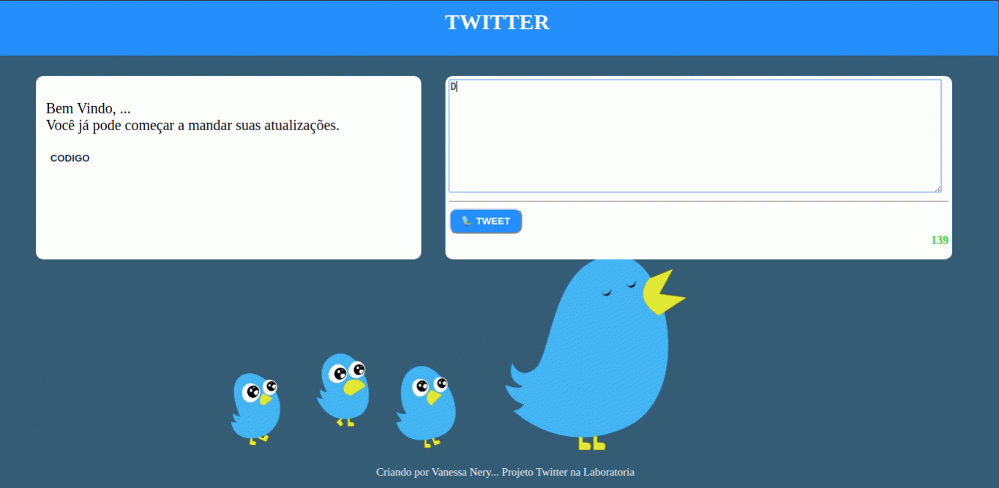

# Desafio Twitter

## Índice

* [1. O Projeto](#1-o-projeto)
* [2. Versão 0.0.1](#2-Versão-0.0.1-✔)
* [3. Versão 0.0.2](#3-Versão-0.0.2-✔)
* [4. Versão 0.0.3](#4-Versão-0.0.3-✔)
* [5. Versão 0.0.4](#5-Versão-0.0.4-✔)
* [6. Versão 0.0.5](#6-Versão-0.0.5-✔)
* [7. Versão 0.0.6](#7-Versão-0.0.6-✔)
* [8. Link do site](#8-Link-do-site)
* [9. Versão 0.0.7 (Hacker edition)](#9-Versão-0.0.7-(Hacker-edition))

***

## 1. O Projeto

Projeto Desafio proposto pela Laboratoria. Como produto final, entregue uma pagina web, que apresentar um feed de notícias do Twitter, com a possibilidade de contar os caracteres de forma regressiva, desativa o botão caso não tenha caracteres na caixa de mensagem, apresenta a data e hora que foi realizado o comentário.

- Prototipo 

- Site 

## 2. Versão 0.0.1 ✔

- Crie um formulário que permita inserir um texto e um botão para "twittar".
- Adicione um evento de click ao botão ou de submit no formulário.
- No evento, obter o texto.
- Adicione o texto ao HTML.

## 3. Versão 0.0.2 ✔

- Não inserir texto vazio (desativar o botão "twittar").
- Conte o número de caracteres de forma regressiva.

## 4. Versão 0.0.3 ✔

- Se você passar os 140 caracteres, desative o botão.
- Se você passar os 120 caracteres, mostre o contador com outra cor.
- Se você passar os 130 caracteres, mostre o contador com outra cor.
- Se você passar os 140 caracteres, mostre o contador em negativo.

## 5. Versão 0.0.4 ✔

- Ao pressionar enter (/n) aumente a área de texto de acordo com o tamanho do texto.

## 6. Versão 0.0.5 ✔

- Se o número de caracteres digitados (sem dar um "enter") exceder o tamanho da área de texto por padrão, mais uma linha deverá ser adicionada para que a rolagem não apareça. (Se aplicável)

## 7. Versão 0.0.6 ✔

- Adicione a hora em que o tweet foi publicado no formato de 24 horas hh:mm.
- Nota: Para formatar a data e a hora, você pode criar sua própria função com métodos nativos do JS ou usar uma biblioteca como `moment.js`.

## 8. Link do site
https://vanesnery.github.io/SAP003-twitter/src/index.html

## 9. Versão 0.0.7 (Hacker edition)

- Salvar os tweets no `localStorage`.

Feito por Vanessa Nery
